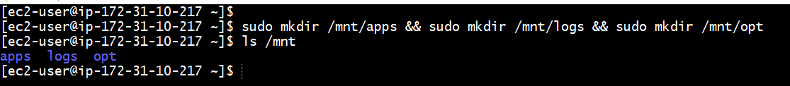
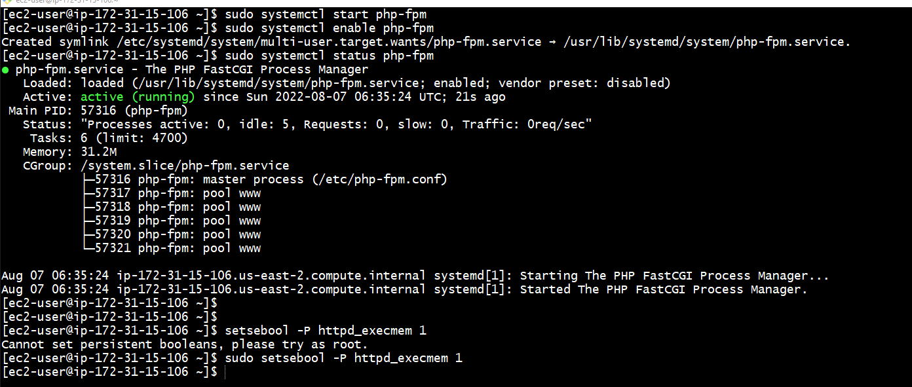

# DEVOPS TOOLING WEBSITE SOLUTION

# Step 0 Setup and technologies used in Project 7
* As a member of a DevOps team, we are implementing a tooling website solution which makes access to DevOps tools within the corporate infrastructure easily accessible.

* This project  implement a solution that consists of following components:

` 1.  Infrastructure: AWS `

` 2. Webserver Linux: Red Hat Enterprise Linux 8  [Three web Servers will be deployed] `

` 3. Database Server: Ubuntu 20.04 installed and configured as MySQL`

` 4. Storage Server: Red Hat Enterprise Linux 8 installed and configured as NFS Server `

` 5. Programming Language: PHP `

` 6. Code Repository: GitHub ` 

* It is important to know what storage solution is suitable for what use cases, for this – we need to answer following questions: what data will be stored, in what format, how this data will be accessed, by whom, from where, how frequently, etc. Base on this we will be able to choose the right storage system for our solution.

## STEP 1 –  NFS SERVER Configuration

* A new EC2 instance with RHEL Linux 8 Operating System. `

* To Configure LVM on the Server. `

* Format all 3 disks as xfs `

* To create 3 Logical Volumes. 

` 1.lv-opt `

` 2.lv-apps `

` 3.lv-logs ` 

* fomating the three volumes as lvm volumes

` sudo gdisk /dev/xvdb ` 

` sudo gdisk /dev/xvdc `

` sudo gdisk /dev/xvdd `

*  Using lsblk utility to view the newly configured partition on each of the 3 disks.

` lsblk `

* Installing lvm2 package to configure the volumes with xfs

` sudo yum install lvm2. ` 

* check for available partitions. 

 ` sudo lvmdiskscan `

 *  Using pvcreate utility to mark each of 3 disks as physical volumes (PVs) to be used by LVM

` sudo pvcreate /dev/xvdb1 `

` sudo pvcreate /dev/xvdc1 `

` sudo pvcreate /dev/xvdd1 `

* Verifing that your Physical volumes above

` sudo pvs `

 *  Using vgcreate utility to add all 3 PVs to a volume group (VG) named tooling-vg

` sudo vgcreate tooling-vg /dev/xvdb1 /dev/xvdc1 /dev/xvdd1 `

*  Verifing VG above

` sudo vgs `

*  Using lvcreate utility to create 3 logical volumes, lv-opt, lv-apps and lv-logs.

` sudo lvcreate -n lv-opt -L 10G tooling-vg `

` sudo lvcreate -n lv-apps -L 10G tooling-vg ` 

` sudo lvcreate -n lv-logs -L 9.5G tooling-vg `

*  Verifing the Logical Volumes

` sudo lvs `

*  Using mkfs.xfs to format the logical volumes with xfs filesystem

` sudo mkfs -t xfs /dev/tooling-vg/lv-opt `

` sudo mkfs -t xfs /dev/tooling-vg/lv-apps `

` sudo mkfs -t xfs /dev/tooling-vg/lv-logs `

* Created dirs and  mount points on /mnt directory for the logical volumes as follow:

` sudo mkdir /mnt/apps && sudo mkdir /mnt/logs && sudo mkdir /mnt/opt `

` sudo mount /dev/tooling-vg/lv-apps  /mnt/apps  # To be used by webservers ` 

` sudo mount /dev/tooling-vg/lv-logs  /mnt/logs  # To be used by webserver logs `

` sudo mount /dev/tooling-vg/lv-opt  /mnt/opt    #  be used by Jenkins server in Project 8 `

*  I need to make the mount points consistent in /etc/fstab and i added the output of blkid below

` sudo blkid `

` sudo vi /etc/fstab `

* Test the configuration and reload the daemon

 ` sudo mount -a `

 ` sudo systemctl daemon-reload `

 

* Installing NFS server, configuring it to start on reboot and makingsure it is up and running

` sudo yum -y update ` 

` sudo yum install nfs-utils -y ` 

` sudo systemctl start nfs-server.service ` 

` sudo systemctl enable nfs-server.service `

` sudo systemctl status nfs-server.service `

* Exporting the mounts points for webservers's subnet cidr to connect as clients. I install all three Web Servers inside the same subnet, 

` (my Subnet CIDR – 172.31.0.0/20 )` 

* I  set up permission that will allow my Web servers to read, write and execute files on NFS: 

` sudo chown -R nobody: /mnt/apps `

` sudo chown -R nobody: /mnt/logs `

` sudo chown -R nobody: /mnt/opt `

` sudo chmod -R 777 /mnt/apps `

` sudo chmod -R 777 /mnt/logs `

` sudo chmod -R 777 /mnt/opt `

` sudo systemctl restart nfs-server.service `

*  Configured access to NFS for clients within the same subnet (my Subnet CIDR – 172.31.0.0/20 ):

` sudo vi /etc/exports `

` /mnt/apps 172.31.0.0/20(rw,sync,no_all_squash,no_root_squash) `

` /mnt/logs 172.31.0.0/20(rw,sync,no_all_squash,no_root_squash) `

` /mnt/opt 172.31.0.0/20(rw,sync,no_all_squash,no_root_squash) `

` sudo exportfs -arv `

* Checking which port is used by NFS and opening it using Security Groups (added new Inbound Rule) 

` rpcinfo -p | grep nfs `

* I Opened following ports: TCP 111, UDP 111, UDP 2049 for NFS server to be accessible from your client

## STEP 2 — CONFIGURING THE DATABASE SERVER on another EC2 instance

* A new EC2 instance with Ubuntu 20.04 O.S
* Install MySQL server 
* Create a database named  ` tooling `
* Create a database user named  ` webaccess`
* Grante permission to webaccess user on tooling database to do anything only from the webservers subnet cidr block

` sudo apt update `

` sudo apt install mysql-server `

` sudo systemctl restart mysql `

` sudo systemctl enable mysql `

` sudo systemctl status mysql `

* Configured DB tooling to work with webservers

` sudo mysql `

` CREATE DATABASE tooling;`

`CREATE USER `webaccess`@`%` IDENTIFIED BY 'mypass';`

`CREATE USER `webaccess`@`%``

`GRANT ALL ON tooling.* TO 'webaccess'@'%';`

`FLUSH PRIVILEGES;`

`SHOW DATABASES;`

`exit`

## Step 3 — Preparing the Web Servers 

* We need to make sure that our Web Servers can serve the same content from shared storage solutions, in our case – NFS Server and MySQL database.

* DB can be accessed for reads and writes by multiple clients and for the shared files, the 3 Web Servers will utilize the NFS  mount points previously created  ` lv-apps ` to the folder where Apache stores files to be served to the users (/var/www).

* This approach will make the Web Servers stateless, which means we will be able to add new ones or remove them whenever we need, and the integrity of the data (in the database and on NFS) will be preserved.

* During the next steps I will do following: Configure NFS clients on all three web servers)

## Step 4 Deploy a Tooling application to the  Web Servers into a shared NFS folder

* Configured the Web Servers to work with a single MySQL database, 
* Launched a new EC2 instance with RHEL 8 Operating System 
* Installed NFS client 

` sudo yum update `

` sudo yum install nfs-utils nfs4-acl-tools -y `

*  mount /var/www/ and target the NFS server’s export for apps

` sudo mkdir /var/www `

` sudo mount -t nfs -o rw,nosuid 172.31.10.217:/mnt/apps /var/www `

*  Verified that NFS was mounted successfully by running df -h. Made sure that the changes will persist on Web Server after reboot:

` df -h `

* making mount point to be persistent 

` sudo vi /etc/fstab `

* added following line

` 172.31.10.217:/mnt/apps /var/www nfs defaults 0 0 `

* Installed Remi’s repository, Apache and PHP

` sudo yum install httpd -y `

` sudo dnf install https://dl.fedoraproject.org/pub/epel/epel-release-latest-8.noarch.rpm `

` sudo dnf install dnf-utils http://rpms.remirepo.net/enterprise/remi-release-8.rpm `

` sudo dnf module reset php `

` sudo dnf module enable php:remi-7.4 `

` sudo dnf install php php-opcache php-gd php-curl php-mysqlnd -y `

` sudo systemctl start php-fpm` 

 ` sudo systemctl enable php-fpm ` 

` sudo setsebool -P httpd_execmem 1 `

## Repeat steps 1-5 for another 2 Web Servers.

*  Verified that Apache files and directories are available on the Web Server in /var/www and also on the NFS server in /mnt/apps. created some new files from one server and checked the same files are accessible from other Web Servers. `

* Located the log folder for Apache on the Web Server and mount it to NFS server’s export for logs. I made sure the mount point is persist after reboot.

 ` /var/log/httpd `

 ` sudo mount -t nfs -o rw,nosuid 172.31.10.217:/mnt/logs /var/log/httpd  `

 

` df -h `

![Image for df -h]

` sudo vi /etc/fstab `

*  added the following line below

` 172.31.10.217:/mnt/logs /var/log/httpd nfs defaults 0 0 `

*  Forked the tooling source code from Darey.io Github Account to my Github account

*  Deployed the tooling website’s code to the Webserver. I copied the contents of the html folder from the repository to /var/www/html

* opened TCP port 80 on the Web Servers

* disabling selinux in /etc/sysconfig/selinux

` sudo setenforce 0 `

 ` vi /etc/sysconfig/selinux and set SELINUX=disabled then restrt httpd. `

 

* disabling the httpd landing page

` sudo mv /etc/httpd/conf.d/welcome.conf /etc/httpd/conf.d/welcome.conf_backup `

* Updated the website’s configuration to connect to the database (in /var/www/html/functions.php file). 

` sudo vi /var/www/html/functions.php `

* added the below line

` $db = mysqli_connect('172.31.9.56', 'webaccess', 'mypass', 'tooling')`

` save and exit.` 

* installed mysql client 

` sudo yum install mysql -y `

* b4 connecting I set mysql bind ips in (/etc/mysql//mysql.conf.d/mysqld.cnf) to 0.0.0.0 by editing  the below

sudo vi /etc/mysql//mysql.conf.d/mysqld.cnf

* Applied tooling-db.sql script to your database using this command 

` sudo mysql -h 172.31.9.56 -u webaccess -p tooling < tooling-db.sql `

1

